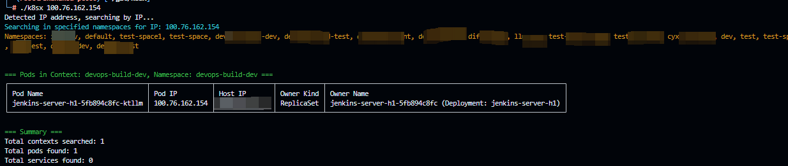
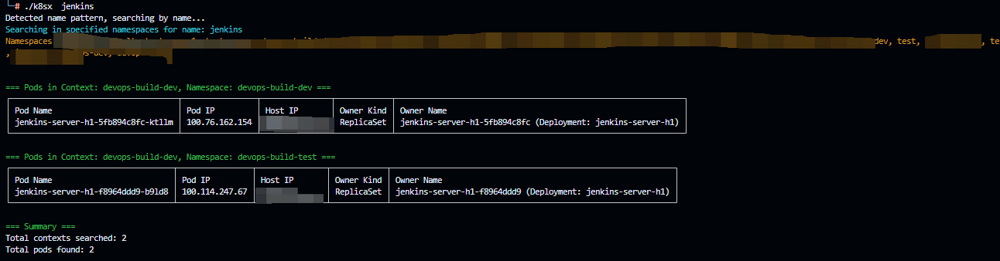

### Usage

- set default kubeconfig path, if it's /root/.kube/config skip 

```
export KUBECONFIG=xxxx
```


- set namespace enviroment

> in my work scene , i have no "get ns" permission , so i need to Preset namespaces list

```
export K8S_SEARCH_NAMESPACES=test,xxx...
```

- search by ip

> k8sx will check all context and all namespace to find the pod ip or svc ip 




- search by name



